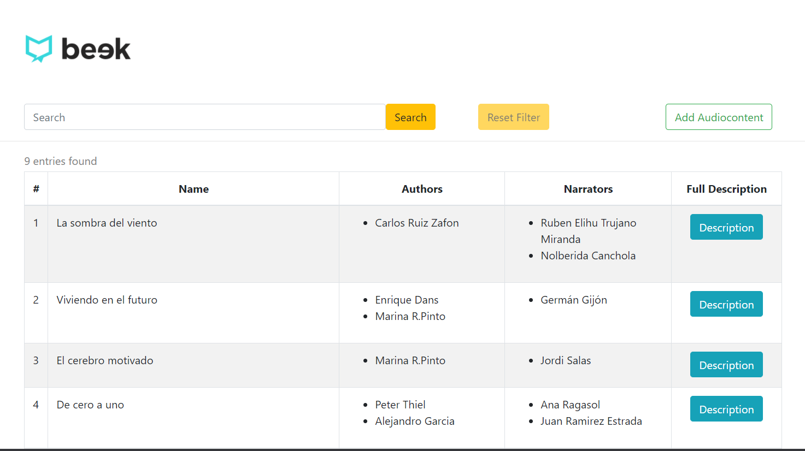
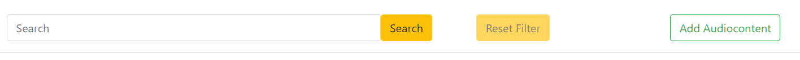
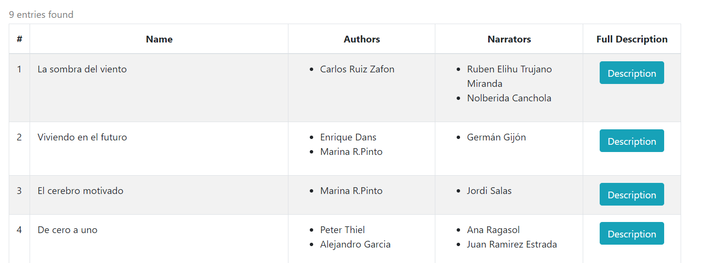
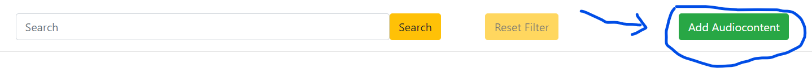
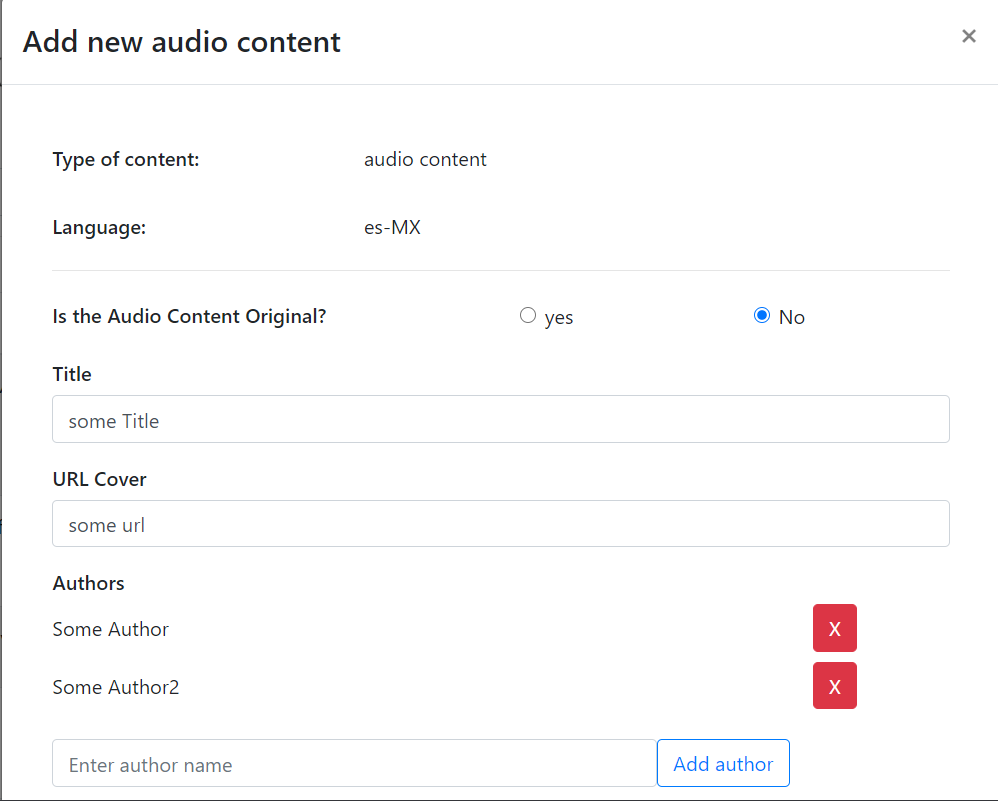
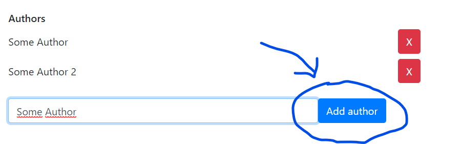
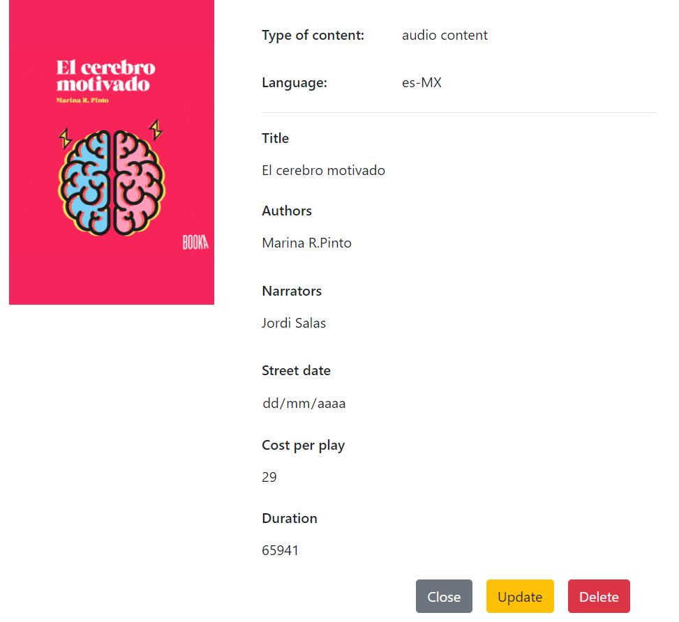

# JUNIOR BEEK FRONTEND CHALLENGE

## requirements

This application was created with:

* git version 2.25.1
* npm version 6.14.4
* node version v10.19.0

## How to run the application

#### Clone the repo

```
git clone https://github.com/ElihuTM/junior-beek-frontend-challenge.git
cd junior-beek-frontend-challenge
```

#### install dependencies
```
npm i
```

#### run application
```
npm run start
```

## How to use the application

#### Home page



The first part of the home page is the bar, in which you can filter the audio content.



The filter will search coincidences on every title book with the string you introduced, also if you want to reset the list of books, you can click on "Reset Filter" button. Additionally, if you don't want to filter, then you will see all the book list.


Above of the bar, you will see the book list, in which you will see the title, authors and narrators of every book.



#### Add New Content

1. Click on "Add AudioContent" button



2. You have to fill out the entire form with the exception of authors and narrators fields, there you can add as many names as you want, but for every name you have to click on "add name" button to added to the list.




**NOTE:** the form won't be submited if you don't fill every field.

#### Description

If you want to see the entire description of any book, you only have to click on "Description" button, there you will see the entire description. Additionally, you can update or delete it with the respective buttons.


## To do

1. add more filter fields
2. allow delete multiple books
3. build a pagination
4. allow sort the items
5. some validations in the form
6. allow empty images and redirect a example image
7. the use of routes
8. clean junk information like books without fields
9. update the hard coding in the language field